---

# 🎓 The Complete MultiModal RAG — End-to-End GenAI Pipeline Course

**By: Abhi Yadav** (Instructor)

> **Tagline:** Learn Retrieval-Augmented Generation (RAG) for text + vision + realtime streams — from scratch to advanced production pipelines. Build real multimodal RAG apps using LanceDB, LlamaIndex, LangChain, Gemini, Vertex AI, AstraDB, Pinecone, FAISS, MongoDB, and more.

---

## 🔎 Course Overview (Short)

This course teaches how to design, build, and deploy **multimodal RAG systems** — systems that combine large models with external knowledge (documents, images, video, streaming data) so responses are accurate, grounded, and up-to-date. The course is project driven: each folder/day contains theory, hands-on notebooks, code templates, and a small practical project.

---

## 🎯 Learning Outcomes

By the end of this course you will be able to:

* Explain RAG architecture and why it prevents hallucination.
* Build RAG pipelines for **text, PDF, images and vision+text** (multimodal).
* Use LanceDB, LlamaIndex, LangChain, FAISS, Pinecone, Weaviate, MongoDB Atlas, AstraDB.
* Integrate LLMs/APIs (Gemini, Mistral, Llama2.1, Gemma, OpenAI) into RAG.
* Implement low-latency realtime ingestion and retrieval pipelines.
* Add conversational memory, entity memory and summary memory.
* Deploy production RAG services (Vertex AI / containerized / serverless).

---

## 📅 Playlist — Day-Wise (Folders & What’s Inside)

Below each folder corresponds to a day/module in the course. Each folder contains: lecture notes, 1–2 Jupyter notebooks, sample datasets, and a short project.

---

### 1) `01_MultiModal_RAG_System_INTRO_Next_GEN_AI_Technology`

**Goal:** Understand what Multimodal RAG is, architectures, business value and design tradeoffs.
**Includes:** slides, mermaid diagrams, `notebooks/00_overview.ipynb`
**Key topics:**

* RAG vs classic LLM prompts
* Multimodal inputs (images, audio, video, tables)
* Chunking strategies for multimodal content
* Evaluation metrics (precision\@k, hallucination rate, factuality)
  **Deliverable:** Simple “Hello RAG” demo (text + single image → answer).

---

### 2) `02_MultiModal_RAG_App_LanceDB_LlamaIndex`

**Goal:** Build a multimodal RAG app using **LanceDB** as vector store + **LlamaIndex** for indexing/queries.
**Includes:** `notebooks/01_lancedb_llamaindex.ipynb`, dataset of mixed docs + images.
**Key topics:**

* LanceDB basics (install, schema, upsert)
* Creating multimodal embeddings (vision + text)
* Index design in LlamaIndex (vector + metadata)
* Retrieval + prompt engineering
  **Deliverable:** App that ingests images+captions+pdfs and answers multimodal queries.

---

### 3) `03_Realtime_MultiModel_RAG_Usecase_Part1`

**Goal:** Start building realtime ingestion pipeline (part 1).
**Includes:** streaming architecture diagrams, `notebooks/02_realtime_ingest_part1.ipynb`
**Key topics:**

* Architecture: producers, stream (Kafka / PubSub), consumers
* Real-time chunking & embedding generation
* Atomic upserts to vector DB
  **Deliverable:** Local demo of realtime ingestion (producer → embeddings → LanceDB).

---

### 4) `04_Realtime_MultiModel_RAG_Usecase_Part2`

**Goal:** Continue realtime pipeline: retrieval + freshness.
**Includes:** `notebooks/03_realtime_retrieval.ipynb`
**Key topics:**

* Near-real-time retrieval and eventual consistency
* Cache strategies & TTLs for recently indexed docs
* Handling duplicates, versioning, soft deletes
  **Deliverable:** Realtime query demo with adjustable freshness parameter.

---

### 5) `05_Realtime_MultiModel_RAG_Usecase_Part3`

**Goal:** Complete realtime pipeline: LLM orchestration, low latency responses.
**Includes:** `notebooks/04_realtime_orchestration.ipynb`
**Key topics:**

* Ensemble retrieval (dense + sparse)
* Hybrid ranking, re-ranking with cross-encoders
* pipelined LLM calls for streaming responses
  **Deliverable:** Realtime chat that shows new data appearing in answers within seconds.

---

### 6) `06_MultiModel_RAG_GeminiPro_Vision_LangChain`

**Goal:** Integrate **Gemini Pro Vision** or other multimodal LLMs with LangChain.
**Includes:** `notebooks/05_gemini_vision_langchain.ipynb`
**Key topics:**

* Using vision-capable LLM endpoints
* Building prompt templates for multimodal context
* LangChain agents + tools for calling vision endpoints
  **Deliverable:** Multimodal assistant that takes an image + doc and returns grounded answers.

---

### 7) `07_Chat_With_Multiple_Doc_AstraDB_LangChain`

**Goal:** Build a chat interface that handles many docs using **AstraDB** (Cassandra) vector search + LangChain.
**Includes:** `notebooks/06_astradb_chat.ipynb`
**Key topics:**

* AstraDB vector indexing & querying
* Chunk-level metadata & doc-level grouping
* Conversation state + retrieval integration
  **Deliverable:** Chat UI that pulls context from thousands of PDFs.

---

### 8) `08_MultiModal_RAG_VertexAI_AstraDB_Langchain`

**Goal:** Productionize: use **Vertex AI** for model serving + AstraDB for vector store + LangChain for orchestration.
**Includes:** `notebooks/07_vertex_deploy.ipynb`, k8s/docker examples.
**Key topics:**

* Containerizing model inference
* Autoscaling for retrieval / model serving
* Monitoring & logging (latency, errors, hallucination checks)
  **Deliverable:** End-to-end deployed RAG microservice (demo with a simple HTTP endpoint).

---

## 📄 Included Files (Resources in repo root)

9. **`100+_Generative_AI_Interview_Question_And_Easy_Answer.docx`** — curated Q\&A for interviews.
10. **`GEN_AI_Interview.pdf`** — compact interviewer-style notes & sample answers.
11. **`thumbnail_multimodal_rag_course.png`** — course cover / thumbnail for videos and socials.
12. **`20_GenAI_Projects_For_Your_Resume.pdf`** — project ideas & short descriptions to beef up portfolios.
13. **`100_GenAI_Interview_Questions_SunnySavita.pdf`** — alternative curated questions list.

---

## 🗂 Suggested Repo Structure (copy/paste)

```
multimodal-rag-course/
├── README.md
├── thumbnail_multimodal_rag_course.png
├── 01_MultiModal_RAG_System_INTRO_Next_GEN_AI_Technology/
│   └── notebooks/00_overview.ipynb
├── 02_MultiModal_RAG_App_LanceDB_LlamaIndex/
│   └── notebooks/01_lancedb_llamaindex.ipynb
├── 03_Realtime_MultiModel_RAG_Usecase_Part1/
│   └── notebooks/02_realtime_ingest_part1.ipynb
...
├── resources/
│   ├── datasets/
│   └── embeddings_sample/
├── docs/
│   └── architecture_diagrams/
├── 100+_Generative_AI_Interview_Question_And_Easy_Answer.docx
├── GEN_AI_Interview.pdf
├── 20_GenAI_Projects_For_Your_Resume.pdf
└── 100_GenAI_Interview_Questions_SunnySavita.pdf
```

---

## 🧰 Prerequisites & Quickstart

**Language:** Python 3.10+ recommended
**Suggested venv:**

```bash
python -m venv .venv
source .venv/bin/activate      # mac / linux
.venv\Scripts\activate         # windows
pip install -U pip
```

**Minimal `requirements.txt` (starter):**

```
langchain
llama-index
lancedb
sentence-transformers
faiss-cpu
transformers
streamlit
uvicorn
fastapi
pydantic
```

Install:

```bash
pip install -r requirements.txt
```

---

## 🧩 Minimal conceptual pipeline (pseudo-code)

This is a conceptual, copy-ready snippet showing the ingestion → embed → store → retrieve → answer flow. Replace placeholder parts with your chosen libraries (LanceDB/LlamaIndex/Gemini etc.).

```python
# PSEUDO-CODE: conceptual pipeline (not library exact)
from sentence_transformers import SentenceTransformer
from my_vector_store_client import VectorStoreClient   # LanceDB / FAISS / Pinecone
from my_llm_client import LLMClient                    # Gemini / Llama / OpenAI

embedder = SentenceTransformer("all-MiniLM-L6-v2")
vecstore = VectorStoreClient.connect("lancedb://local-db")
llm = LLMClient(api_key="...")   # or local Llama endpoint

# 1) Ingest documents (pdfs / images / text)
docs = load_documents("datasets/company_policies/")
chunks = chunk_documents(docs, chunk_size=512)

# 2) Create multimodal embeddings (text + optional image embeddings)
embeddings = [embedder.encode(c.text) for c in chunks]
vecstore.upsert(ids=[c.id for c in chunks], vectors=embeddings, metadata=[c.meta for c in chunks])

# 3) Query time
query = "What is the refund policy for enterprise customers?"
q_emb = embedder.encode(query)
hits = vecstore.search(q_emb, top_k=5)

# 4) Build prompt with retrieved contexts
context = "\n\n".join([h.metadata['text'] for h in hits])
prompt = f"Answer using only the context below. If not present say 'I don't know'.\n\n{context}\n\nQuestion: {query}"

# 5) Ask LLM
answer = llm.generate(prompt)
print(answer)
```

---

## ✅ Projects & Assessments (per day)

* **Small exercises:** after each notebook, a short coding task (ingest a new file type, tune chunk size, evaluate retrieval precision).
* **Mini projects:** (every 3 days) build a small app and present a short technical readme + video demo.
* **Capstone:** Build a production-grade multimodal RAG app: realtime ingestion + multimodal retrieval + deployable endpoint + test suite + CI/CD pipeline.

---

## 📦 Deployment & Production Tips

* Use **separate clusters** for indexing and serving to protect availability.
* Apply **rate limits** and **response validation** (e.g., verifying facts against retrieval results).
* Monitor drift (semantic and data drift) — maintain retraining/upsert schedules.
* Add a “fallback” policy — if retrieval confidence is low, escalate to human or return a safe response.

---

## 💬 README badges (copy/paste)

```


```

---

## 📣 How to publish this to GitHub (example commands)

```bash
git init
git add .
git commit -m "chore: add Complete MultiModal RAG course README + notebooks"
gh repo create multimodal-rag-course --public
git push -u origin main
```

---

## ✍️ Suggested `README.md` summary for top of repo (one-line)

`"The Complete MultiModal RAG — End-to-End GenAI Pipeline Course by Sunny — build multimodal RAG systems with LanceDB, LlamaIndex, LangChain, Vertex AI, and more."`

---

# 🌳 Multimodal RAG Course — LangGraph & Tree Workflow

This document provides three student-friendly views of the course: an **ASCII tree**, a **Mermaid graph** (renders on GitHub), and a runnable **LangGraph** syllabus navigator (Python) you can adapt. Drop these into your README or use the Python navigator as a lightweight CLI to guide learners.

---

## 1) High-level ASCII Tree

```
Multimodal RAG Course (Sunny / Abhi Yadav)
│
├── 00. Intro: What is Multimodal RAG?
│
├── 01. MultiModal RAG System INTRO
│
├── 02. LanceDB + LlamaIndex Multimodal App
│
├── 03. Realtime MultiModel RAG — Part 1 (Ingest)
│
├── 04. Realtime MultiModel RAG — Part 2 (Retrieval)
│
├── 05. Realtime MultiModel RAG — Part 3 (Orchestration)
│
├── 06. Gemini Pro Vision + LangChain (Vision + Text)
│
├── 07. Chat_With_Multiple_Doc (AstraDB + LangChain)
│
├── 08. Vertex AI + AstraDB + LangChain (Productionize)
│
└── Resources & Extras
    ├── Interview Qs (100+ Word + PDFs)
    ├── Course Banner (thumbnail image)
    └── Project ideas + Templates
```

---

## 2) Mermaid Tree (GitHub-ready)

> Paste this block in your `README.md` where GitHub renders Mermaid.

```mermaid
flowchart TB
  A[Multimodal RAG Course]:::root

  A --> I00[00 • Intro]

  A --> M01[01 • MultiModal RAG System INTRO]

  A --> M02[02 • LanceDB + LlamaIndex]
  M02 --> M02a[LanceDB ingestion]
  M02 --> M02b[LlamaIndex indexing]
  M02 --> M02c[Multimodal embeddings]

  A --> R03[03 • Realtime RAG Part 1]
  R03 --> R03a[Streaming producers]
  R03 --> R03b[Chunking & Embeddings]

  A --> R04[04 • Realtime RAG Part 2]
  R04 --> R04a[Upserts & Freshness]
  R04 --> R04b[Hybrid retrieval]

  A --> R05[05 • Realtime RAG Part 3]
  R05 --> R05a[Cross-encoder re-ranking]
  R05 --> R05b[Low-latency LLM orchestration]

  A --> G06[06 • Gemini Vision + LangChain]

  A --> C07[07 • Chat with Multiple Docs (AstraDB)]

  A --> P08[08 • Vertex AI + AstraDB + LangChain (Prod)]

  A --> RES[Resources]
  RES --> RES1[Interview Qs]
  RES --> RES2[Course Banner]
  RES --> RES3[Project Templates]

  classDef root fill:#0b2545,stroke:#0b2545,color:#ffffff;
```

---

## 3) Decision Tree — "When to choose which module"

```mermaid
flowchart TD
  S([Start — What do you want?])
  S -->|Learn fundamentals| M01
  S -->|Build multimodal app| M02
  S -->|Realtime / streaming| R03
  S -->|Vision LLMs| G06
  S -->|Deploy to prod| P08
```



---

## 4) Runnable LangGraph Navigator (Python)

> Copy this into a file `langgraph_nav.py`. It is a minimal, easy-to-extend syllabus runner. Requires a simple `StateGraph` utility; if you don't have LangGraph installed, use the logic as-is to implement your own CLI.

```python
# langgraph_nav.py
from dataclasses import dataclass, field
from typing import List, Dict

@dataclass
class CourseState:
    node: str = "intro"
    history: List[str] = field(default_factory=list)
    resources: Dict[str, List[str]] = field(default_factory=dict)

# Node handlers return updated state

def node_intro(state: CourseState) -> CourseState:
    state.history.append("00_intro")
    state.resources['00_intro'] = [
        'notes/00_intro.md',
        'notebooks/00_overview.ipynb'
    ]
    return state

def node_lancedb_llama(state: CourseState) -> CourseState:
    state.history.append('02_lancedb_llama')
    state.resources['02_lancedb_llama'] = [
        'notebooks/01_lancedb_llamaindex.ipynb',
        'datasets/multimodal_sample/'
    ]
    return state

def node_realtime_part1(state: CourseState) -> CourseState:
    state.history.append('03_realtime_p1')
    state.resources['03_realtime_p1'] = [
        'notebooks/02_realtime_ingest_part1.ipynb'
    ]
    return state

# add other node functions similarly: part2, part3, gemini, astra, vertex

# Simple router based on linear order but supports intent jumps
ORDER = [
    '00_intro', '01_system_intro', '02_lancedb_llama',
    '03_realtime_p1', '04_realtime_p2', '05_realtime_p3',
    '06_gemini_vision', '07_astradb_chat', '08_vertex_prod'
]

def next_node(state: CourseState, intent: str = None) -> str:
    if intent == 'deploy':
        return '08_vertex_prod'
    if intent == 'realtime':
        return '03_realtime_p1'
    # default: next unvisited in ORDER
    visited = set(state.history)
    for q in ORDER:
        if q not in visited:
            return q
    return 'END'

# Minimal CLI runner
if __name__ == '__main__':
    state = CourseState()
    # manual example run
    while True:
        nxt = next_node(state)
        if nxt == 'END':
            break
        print('Navigating to:', nxt)
        if nxt == '00_intro':
            state = node_intro(state)
        elif nxt == '02_lancedb_llama':
            state = node_lancedb_llama(state)
        elif nxt == '03_realtime_p1':
            state = node_realtime_part1(state)
        else:
            # default append placeholder
            state.history.append(nxt)
            state.resources[nxt] = [f'notebooks/{nxt}.ipynb']

    print('\nCourse path completed:')
    print(state.history)
    print('Resources keys:', list(state.resources.keys()))
```

**How to extend**

* Replace `state.resources` values with real notebook paths and video links.
* Add quiz nodes that branch on `score` (e.g., low score -> remedial nodes).
* Persist `state.history` per learner in a JSON file for resuming.

---

## 5) Compact Milestone Map (Student View)

```
Milestones:
1. Intro → 2. LanceDB+Index → 3. Realtime Ingest → 4. Realtime Retrieval → 5. Realtime Orchestration → 6. Gemini Vision → 7. Multi‑doc Chat → 8. Production Deploy
```

---


---

## 👨‍💻 Developer Information  

**Created by Abhi Yadav**  
📧 **Email:** abhiydv23096@gmail.com  
🔗 **LinkedIn:** [Abhi Yadav](https://www.linkedin.com/in/your-linkedin-profile)  
🐙 **GitHub Profile:** [@abhishekkumar62000](https://github.com/abhishekkumar62000)  

📸 **Developer Profile Image:**  

<p align="center">
  
</p>


---

🔥 *This repository + video series is your one-stop place for mastering **RAG & MultiModel RAG LLM RAG Pineline Mastery***.

---
